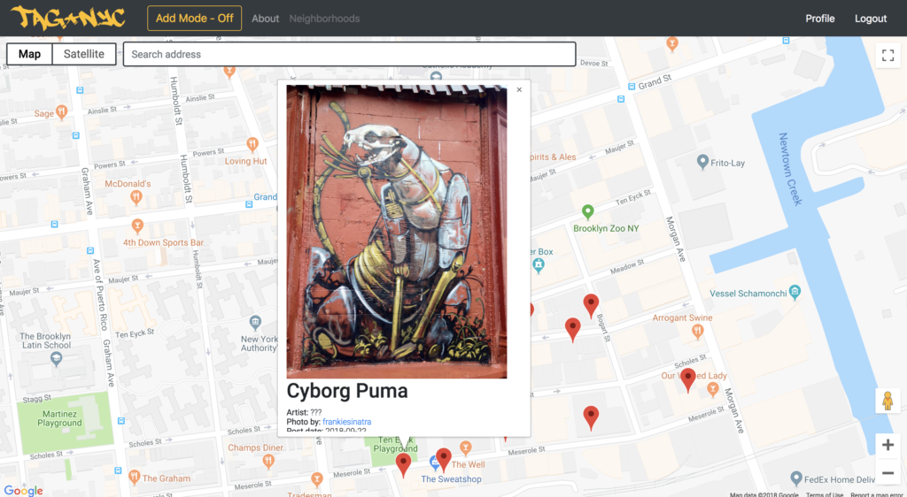
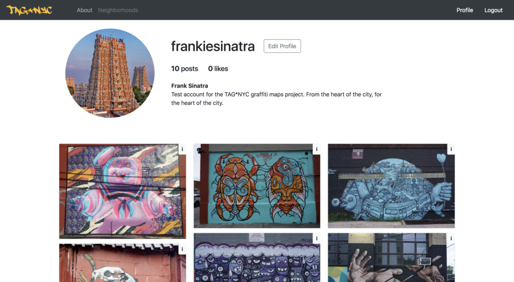

# TAG-NYC Graffiti Open Maps Project
The Tag-NYC project is a dynamic mapping application, dedicated to perserving and sharing snapshots of New York City's thriving graffiti culture.

**Live Heroku Link:** https://warm-atoll-35950.herokuapp.com/

- **Login:** test@test.com
- **Password:** password

## Features and Usage 
Users without an account can explore the maps and view the lightbox galleries within individual users' profiles. But in order add markers and images to the maps/galleries, they must sign up. If anyone wants to test the edit and destroy functions of an already exsisting account with use the credentials shared above in Heroku.

## Built With
- Ruby on Rails
- ES6 Javascript
- Google Maps Javascript API
- Google Places API
- Bootstrap
- Amazon S3 Cloud Database Storage
- PostgreSQL
